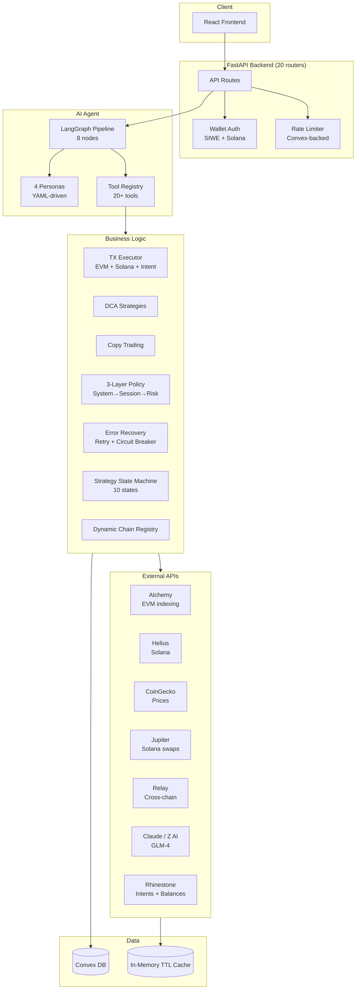

# Sherpa Backend Codebase Map

> Auto-generated by Cartographer. Last mapped: 2026-02-06
> **Files**: 284 | **Tokens**: ~576k

## System Overview

Sherpa is an AI-powered DeFi portfolio assistant. Python FastAPI backend with LLM-driven natural language (LangGraph ReAct), automated trading strategies (DCA, Copy Trading), multi-chain support (EVM + Solana), Rhinestone Smart Sessions for autonomous execution, and 3-layer policy engine.



## Directory Structure

```
backend/
├── app/
│   ├── main.py                   # FastAPI entry (20 routers, CORS, startup)
│   ├── config.py                 # Pydantic settings (3123 tokens)
│   ├── cache.py                  # In-memory TTL cache (LRU, async)
│   │
│   ├── api/                      # 20 route files
│   │   ├── auth.py               # /auth/* (nonce, verify, refresh, me, logout)
│   │   ├── chat.py               # /chat, /chat/stream (SSE)
│   │   ├── conversations.py      # /conversations/*
│   │   ├── copy_trading.py       # /copy-trading/* (relationships, leaders, executions)
│   │   ├── dca.py                # /dca/* + /dca/internal/execute
│   │   ├── entitlement.py        # /entitlement (token-gated Pro)
│   │   ├── health.py             # /healthz
│   │   ├── history_summary.py    # /wallets/{address}/history-summary
│   │   ├── llm.py                # /llm/providers
│   │   ├── news.py               # /news/* + /news/internal/*
│   │   ├── perps.py              # /perps/simulate
│   │   ├── permissions.py        # /permissions/* (session grants)
│   │   ├── polymarket.py         # /polymarket/* (markets, trading, copy)
│   │   ├── relay.py              # /tools/relay/quote
│   │   ├── smart_accounts.py     # /smart-accounts/* (balances, gas, session key)
│   │   ├── swap.py               # /swap/quote
│   │   ├── swig_wallets.py       # /swig-wallets/* (Solana smart wallets)
│   │   ├── tools.py              # /tools/portfolio, /tools/prices/*, /tools/defillama/*
│   │   └── webhooks.py           # /webhooks/alchemy, /webhooks/helius
│   │
│   ├── core/                     # Business logic (84 files, ~232k tokens)
│   │   ├── agent/                # LangGraph AI agent
│   │   │   ├── base.py           # Agent orchestrator (~3000 lines)
│   │   │   ├── graph.py          # LangGraph DAG (8 nodes)
│   │   │   ├── context.py        # Conversation memory + Convex sync
│   │   │   ├── tools.py          # Tool registry (20+ tools)
│   │   │   ├── personas.py       # YAML-driven persona system
│   │   │   └── styles.py         # Response formatting
│   │   │
│   │   ├── execution/            # Transaction execution
│   │   │   ├── executor.py       # EVM TX lifecycle (~1535 lines)
│   │   │   ├── erc4337_executor.py # UserOp bundler submission
│   │   │   ├── relay_adapter.py  # Relay quote → SwapQuote adapter
│   │   │   ├── solana_executor.py # Solana TX via Jupiter
│   │   │   ├── nonce_manager.py  # Concurrent nonce tracking
│   │   │   └── tx_builder.py     # Transaction construction
│   │   │
│   │   ├── swap/                 # Swap orchestration
│   │   │   └── manager.py        # SwapManager (~1506 lines) - NL parsing → Relay/Jupiter
│   │   │
│   │   ├── bridge/               # Cross-chain bridging
│   │   │   ├── manager.py        # BridgeManager (~827 lines)
│   │   │   └── chain_registry.py # Dynamic ChainRegistry (Relay API, 1h cache)
│   │   │
│   │   ├── strategies/dca/       # Dollar-cost averaging
│   │   │   ├── executor.py       # DCA execution (~1038 lines) - routes to intent or direct
│   │   │   ├── service.py        # DCA CRUD & lifecycle
│   │   │   ├── scheduler.py      # Next execution calc (hourly→monthly + cron)
│   │   │   └── models.py         # DCAStrategy, DCAConfig, DCAExecution
│   │   │
│   │   ├── copy_trading/         # Copy trading system
│   │   │   ├── manager.py        # Relationship CRUD, signal processing
│   │   │   ├── executor.py       # Cross-chain execution
│   │   │   ├── analytics.py      # Leader performance (Sharpe, win rate, drawdown)
│   │   │   ├── sizing.py         # Position sizing (percentage, fixed, proportional)
│   │   │   └── event_bridge.py   # Event → TradeSignal bridge
│   │   │
│   │   ├── planning/             # Plan creation
│   │   │   ├── service.py        # Interactive + autonomous plan creation
│   │   │   ├── protocol.py       # TradeIntent, AmountSpec abstractions
│   │   │   ├── models.py         # Plan, Action, DecisionLog
│   │   │   └── registry.py       # YAML activity registry
│   │   │
│   │   ├── strategy/             # Execution state machine
│   │   │   └── state_machine.py  # 10 states, validated transitions, timeouts
│   │   │
│   │   ├── policy/               # 3-layer policy engine
│   │   │   ├── engine.py         # Orchestrator (System→Fee→Session→Risk)
│   │   │   ├── system_policy.py  # Emergency stop, blocklists
│   │   │   ├── session_policy.py # Session key constraints
│   │   │   └── risk_policy.py    # User limits (position, slippage, daily)
│   │   │
│   │   ├── recovery/             # Error handling
│   │   │   ├── executor.py       # Retry + circuit breaker + fallback
│   │   │   └── errors.py         # Error classification (7 categories)
│   │   │
│   │   └── wallet/               # Wallet & session management
│   │       ├── smart_sessions.py # Rhinestone config builders + presets
│   │       └── swig_session.py   # Swig session authority (Solana)
│   │
│   ├── providers/                # External API clients (20 files, ~41k tokens)
│   │   ├── base.py               # Provider/IndexerProvider/PriceProvider abstractions
│   │   ├── alchemy.py            # Alchemy EVM (balances, metadata, NFTs)
│   │   ├── solana.py             # Helius Solana (SOL + SPL balances)
│   │   ├── coingecko.py          # Prices, metadata, charts, trending
│   │   ├── jupiter.py            # Solana token list + swap quotes
│   │   ├── relay.py              # Cross-chain bridge quotes (v2 API)
│   │   ├── rhinestone.py         # Intent submission + multi-chain balances
│   │   ├── bundler.py            # ERC-4337 UserOp submission
│   │   ├── paymaster.py          # Gas sponsorship (USDC-first)
│   │   ├── swig.py               # Solana smart wallet sessions
│   │   ├── birdeye.py            # Solana DeFi analytics
│   │   ├── token_list.py         # Fallback token metadata + spam detection
│   │   ├── llm/base.py           # LLM abstraction (message, tool, response)
│   │   ├── llm/anthropic.py      # Claude with native tool calling
│   │   ├── llm/zai.py            # Z AI / GLM-4 (OpenAI-compatible)
│   │   └── polymarket/           # Prediction market client
│   │
│   ├── services/                 # Business services (41 files, ~103k tokens)
│   │   ├── token_resolution.py   # Multi-source token lookup (10 sources, confidence scoring)
│   │   ├── chains.py             # Dynamic chain metadata from Convex
│   │   ├── unified_balance.py    # Multi-chain balance aggregation (Rhinestone)
│   │   ├── gas_abstraction.py    # USDC-first gas estimation
│   │   ├── activity_summary.py   # Wallet activity reports
│   │   ├── portfolio_activity.py # Multi-chain portfolio activity
│   │   ├── history_comparison.py # Time window comparison
│   │   ├── token_chart.py        # Price chart data
│   │   ├── trending.py           # Trending tokens
│   │   ├── entitlement.py        # Token-gated Pro access
│   │   ├── address.py            # Chain/address utilities
│   │   ├── news_fetcher/         # Multi-source news aggregation
│   │   ├── events/               # Webhook event processing
│   │   ├── relevance/            # Content relevance scoring
│   │   └── token_catalog/        # Token taxonomy + portfolio profiling
│   │
│   ├── tools/                    # Data aggregation tools
│   │   ├── portfolio.py          # Multi-chain portfolio tool
│   │   ├── aggregators.py        # Swap quote aggregation
│   │   ├── defillama.py          # Protocol TVL data
│   │   └── polymarket.py         # Prediction market tools
│   │
│   ├── agent_runtime/            # Background scheduler
│   │   ├── runtime.py            # Event loop (max 4 concurrent, 20s timeout)
│   │   ├── strategy.py           # Base strategy class
│   │   ├── router.py             # /runtime/* control API
│   │   └── strategies/           # Built-in: heartbeat, execution_poller
│   │
│   ├── auth/                     # Authentication
│   │   ├── service.py            # Wallet sign-in + JWT (HS256, 60min/7day)
│   │   ├── middleware.py         # FastAPI deps (require_auth, optional_auth, scopes)
│   │   ├── models.py             # VerifiedWallet, AuthSession, TokenPayload
│   │   └── solana_signin.py      # Solana Ed25519 verification
│   │
│   ├── db/
│   │   └── convex_client.py      # Async HTTP client for Convex
│   │
│   ├── middleware/
│   │   └── rate_limit.py         # Sliding window (Convex-backed, fail-open)
│   │
│   ├── workers/                  # Background tasks
│   │   ├── exports.py            # History CSV/JSON export
│   │   └── news_processor_worker.py # LLM news classification
│   │
│   └── types/                    # Pydantic models
│       └── envelope.py           # ToolEnvelope response wrapper
│
├── personas/                     # AI persona configs (YAML)
│   ├── friendly.yaml             # Warm, conversational
│   ├── technical.yaml            # Analytical, precise
│   ├── professional.yaml         # Formal, advisory
│   └── educational.yaml          # Patient, teaching
│
├── activities/                   # Activity definitions (YAML)
│   ├── swap.yaml                 # Swap guardrails (1% slippage, $5k approval)
│   ├── bridge.yaml               # Bridge guardrails
│   └── strategies/dca.yaml       # DCA config (extends swap, 0.5% slippage)
│
├── tests/                        # 38 files, ~76k tokens
├── scripts/                      # 6 files (test harnesses, Convex test)
├── docs/                         # 21 files (API docs, Alchemy specs)
├── cli.py                        # CLI: portfolio, chat, wallet-history
├── pyproject.toml                # Python 3.11, FastAPI, LangGraph, SIWE
└── railway.toml                  # Deployment: Nixpacks, 1 worker
```

## API Surface (Complete)

### Public Endpoints

**Auth** (`/auth`):
| Method | Path | Purpose |
|--------|------|---------|
| POST | `/auth/nonce` | Generate nonce for wallet sign-in |
| POST | `/auth/verify` | Verify signature → JWT session |
| POST | `/auth/refresh` | Refresh access token |
| GET | `/auth/me` | Current session info (requires auth) |
| POST | `/auth/logout` | Revoke session (requires auth) |

**Chat** (`/chat`):
| Method | Path | Purpose |
|--------|------|---------|
| POST | `/chat` | Sync chat |
| POST | `/chat/stream` | SSE streaming chat |

**Strategies** (`/dca`, `/copy-trading`):
| Method | Path | Purpose |
|--------|------|---------|
| POST | `/dca` | Create DCA strategy (draft) |
| POST | `/dca/{id}/activate` | Activate with session key |
| POST | `/dca/{id}/pause` | Pause |
| POST | `/dca/{id}/resume` | Resume |
| POST | `/dca/{id}/stop` | Stop/complete |
| GET | `/dca/{id}/performance` | Performance metrics |
| POST | `/copy-trading/relationships` | Create copy relationship |
| GET | `/copy-trading/leaderboard` | Top leaders |

**Smart Accounts** (`/smart-accounts`, `/permissions`):
| Method | Path | Purpose |
|--------|------|---------|
| GET | `/smart-accounts/session-keypair/public` | Backend session key address |
| GET | `/smart-accounts/{addr}/balances` | Unified multi-chain balances |
| GET | `/smart-accounts/gas/estimate` | USDC gas estimation |
| POST | `/permissions/request` | Request permission grant config |
| POST | `/permissions/confirm` | Confirm on-chain grant |
| GET | `/permissions/{wallet}` | List active permissions |

**Tools & Data** (`/tools`, `/swap`, `/news`, `/polymarket`):
| Method | Path | Purpose |
|--------|------|---------|
| GET | `/tools/portfolio` | Portfolio balances |
| GET | `/tools/prices/top` | Top coins by market cap |
| GET | `/tools/prices/trending` | Trending EVM tokens |
| POST | `/swap/quote` | Swap quote (supports USD amount) |
| POST | `/tools/relay/quote` | Cross-chain bridge quote |
| GET | `/news` | Recent news (category/hours filters) |
| GET | `/polymarket/markets` | Prediction markets |

### Internal Endpoints (Convex Cron → Backend)

| Endpoint | Caller | Body |
|----------|--------|------|
| `POST /dca/internal/execute` | `scheduler.checkDCAStrategies` | `{ strategyId }` |
| `POST /news/internal/fetch` | `scheduler.fetchNews` | (empty) |
| `POST /news/internal/process` | `scheduler.processNews` | `?limit=50` |

Auth: `X-Internal-Key` header. Contract tests: `tests/contract/test_convex_api_contracts.py`

---

## Agent System

### LangGraph Pipeline (8 nodes)

```
handle_style → determine_persona → prepare_context → run_react_loop
  → handle_bridge/swap → format_response → update_conversation
```

### ReAct Loop
- LLM-native tool calling (not keyword-based)
- Max 5 iterations
- Tools: `get_portfolio`, `get_token_chart`, `get_trending_tokens`, `get_wallet_history`, `get_tvl_data`, `get_news`, `get_swap_quote`, `get_bridge_quote`, policy tools

### Personas (YAML)
| Persona | Tone | Auto-detect keywords |
|---------|------|---------------------|
| `friendly` | Warm, conversational | help, explain, beginner, simple |
| `technical` | Analytical, precise | analysis, metrics, defi, tvl, yield |
| `professional` | Formal, advisory | investment, portfolio, compliance |
| `educational` | Patient, adaptive | learn, teach, what is, how does |

All personas: identify as "Sherpa" (never Claude), MUST use tools (never make up data), no emojis.

---

## Execution Pipeline

### EVM Swap/Bridge Flow
```
User → Agent tool (get_swap_quote) → SwapManager
  → Parse intent (tokens, amounts, chains)
  → Resolve tokens (TokenResolutionService, 10 sources)
  → ChainRegistry.detect_chain_in_text()
  → Relay API /quote/v2
  → Build unsigned tx → Return to frontend
  → User signs → TransactionExecutor.execute_swap()
  → Monitor confirmation → Log to Convex
```

### DCA Autonomous Execution
```
Convex cron (1 min) → POST /dca/internal/execute
  → DCAExecutor.execute()
    → Validate Smart Session (spending limits, expiry, actions)
    → Check market conditions (gas, price bounds)
    → Get swap quote (Relay or Jupiter)
    → PolicyEngine.evaluate() (System→Fee→Session→Risk)
    → Route:
      - smart_session_id set → submit Rhinestone intent
      - else → TransactionExecutor with session key
      - Solana → Jupiter swap
    → Record execution → Update stats → Schedule next
```

### Token Resolution (10 sources, priority order)
1. EXACT_ADDRESS (1.0) → 2. REGISTRY (0.95) → 3. PORTFOLIO (0.90) → 4. REGISTRY_ALIAS (0.85) → 5. JUPITER_EXACT (0.80) → 6. COINGECKO_EXACT (0.80) → 7. JUPITER_SEARCH (0.60) → 8. COINGECKO_SEARCH (0.60) → 9. ALCHEMY (0.55) → 10. FUZZY (0.40)

---

## Policy Engine

**Evaluation order** (short-circuits on system block):

| Layer | File | Checks |
|-------|------|--------|
| **System** | `system_policy.py` | Emergency stop, maintenance, blocked contracts/tokens/chains |
| **Fee** | (in engine) | Gas abstraction limits, paymaster rules |
| **Session** | `session_policy.py` | Time bounds, value limits (per-tx, daily, total), action permissions, token/chain allowlists |
| **Risk** | `risk_policy.py` | Max position %, max slippage, max daily tx USD, max single tx USD |

Output: `PolicyResult` with approved/violations/warnings/risk_level/approval_requirement.

---

## Providers

| Provider | File | Purpose | API |
|----------|------|---------|-----|
| **Alchemy** | `alchemy.py` | EVM balances, metadata, NFTs | Alchemy REST (7 chains) |
| **Helius** | `solana.py` | SOL + SPL balances | Helius REST |
| **CoinGecko** | `coingecko.py` | Prices, charts, trending, metadata | CoinGecko v3 |
| **Jupiter** | `jupiter.py` | Solana token list (1500 strict), swap quotes | Jupiter v6 |
| **Relay** | `relay.py` | Cross-chain quotes (v2 API) | Relay REST |
| **Rhinestone** | `rhinestone.py` | Intent submission, multi-chain balances | Rhinestone REST |
| **Bundler** | `bundler.py` | ERC-4337 UserOp submission | JSON-RPC |
| **Paymaster** | `paymaster.py` | Gas sponsorship (USDC-first) | JSON-RPC |
| **Swig** | `swig.py` | Solana smart wallet sessions | Swig REST |
| **Birdeye** | `birdeye.py` | Solana top traders, DeFi analytics | Birdeye REST |
| **Anthropic** | `llm/anthropic.py` | Claude with native tool calling | Anthropic API |
| **Z AI** | `llm/zai.py` | GLM-4 (OpenAI-compatible) | Z AI REST |
| **Polymarket** | `polymarket/` | Prediction markets, order books | Gamma + CLOB APIs |

All providers: singleton instances, health checks, configurable via `app/config.py`.

---

## Services

| Service | File | Purpose |
|---------|------|---------|
| **TokenResolutionService** | `token_resolution.py` | 10-source lookup with confidence scoring + ambiguity detection |
| **ChainService** | `chains.py` | Dynamic chain metadata from Convex (5 min cache) |
| **UnifiedBalanceService** | `unified_balance.py` | Multi-chain aggregation via Rhinestone (30s cache) |
| **GasAbstractionService** | `gas_abstraction.py` | USDC-first gas estimation with chain multipliers |
| **ActivitySummary** | `activity_summary.py` | Time-bucketed wallet reports |
| **NewsFetcher** | `news_fetcher/` | RSS + API aggregation with source diversity |
| **TokenCatalog** | `token_catalog/` | Token taxonomy, portfolio profiling |
| **Events** | `events/` | Alchemy/Helius webhook processing |

---

## Authentication

```
1. POST /auth/nonce → Generate nonce (10 min TTL, stored in Convex)
2. Client signs SIWE (EVM) or Solana sign-in message
3. POST /auth/verify → Verify signature, create JWT session
4. Bearer token in subsequent requests
5. POST /auth/refresh → Rotate tokens
6. POST /auth/logout → Revoke session
```

**JWT**: HS256, secret = `convex_internal_api_key`, access = 60 min, refresh = 7 days.
**Scopes**: READ_PORTFOLIO, READ_HISTORY, EXECUTE_STRATEGY, MANAGE_STRATEGIES, ADMIN.
**Note**: Most endpoints don't require auth — they use wallet_address/user_id for ownership.

---

## Test Suite

### Organization

| Type | Location | Purpose |
|------|----------|---------|
| **Contract** | `tests/contract/` | Convex ↔ Backend payload format validation |
| **Unit** | `tests/unit/` | Token resolution, activity, portfolio |
| **Core** | `tests/core/` | Planning, DCA, policy, state machine, recovery |
| **Feature** | `tests/` | Copy trading, agent tools, conversations |
| **API** | `tests/` | Endpoint tests with mocked dependencies |

### Coverage Highlights

| Area | Quality |
|------|---------|
| Policy engine | Excellent (525 lines, all 3 layers) |
| State machine | Excellent (all transitions + recovery) |
| Error recovery | Excellent (classification + retry + circuit breaker) |
| Token resolution | Excellent (EVM + Solana + ambiguity) |
| DCA strategies | Excellent (scheduling + execution + constraints) |
| Copy trading | Excellent (sizing + analytics + full flow) |
| Contract tests | Good (DCA + news internal endpoints) |
| Real integrations | Minimal (all providers mocked) |

### Running Tests

```bash
cd backend
pytest tests/ -x -q                    # All tests
pytest tests/contract/ -v              # Contract tests (run before deploy!)
python scripts/test_chat.py --interactive  # Interactive chat test
python scripts/test_bridge_flow.py     # Bridge E2E test
```

---

## Conventions

### Naming
- `*Provider`: External API client
- `*Service`: Business logic orchestrator
- `*Manager`: Stateful orchestrator
- `*Executor`: Transaction/action executor
- `*Handler`: Event/webhook processor

### Code Style
- Type hints everywhere
- Async/await for all I/O
- Pydantic v2 for all models
- Singleton pattern for providers/managers
- Black: line-length=100, target py311

---

## Navigation Guide

**To add a new API endpoint**:
1. Create handler in `app/api/`
2. Register router in `app/main.py`
3. Add Pydantic models to `app/types/`

**To add a new agent tool**:
1. Add handler in `app/core/agent/tools.py`
2. Register in `ToolRegistry` with definition

**To add a new persona**:
1. Create YAML in `personas/`
2. Add auto-detection keywords

**To add a new provider**:
1. Implement `Provider` base in `app/providers/`
2. Add health check + singleton factory
3. Add config to `app/config.py`

**To add a new strategy type**:
1. Create module in `app/core/strategies/`
2. Implement executor, scheduler, models
3. Add API endpoints in `app/api/`
4. Add YAML in `activities/`

**To modify policy rules**:
1. Edit relevant policy in `app/core/policy/`
2. Update PolicyEngine if new layer

**To add an internal endpoint** (called by Convex):
1. Add endpoint in `app/api/` with `X-Internal-Key` validation
2. Add contract test in `tests/contract/test_convex_api_contracts.py`
3. Add cross-reference comment in both Python and TypeScript

---

## Gotchas

1. **Cross-chain = bridging**: Don't distinguish them — Relay API handles all cross-chain operations
2. **Dynamic ChainRegistry**: Never hardcode chain info — use `ChainRegistry` (fetched from Relay, 1h cache)
3. **Convex field names**: Backend snake_case vs Convex camelCase — use `Field(alias="camelCase")` in Pydantic
4. **Internal endpoint auth**: Always `X-Internal-Key` header, never trust caller identity
5. **Session key ownership**: Backend session key signs intents, not user wallets
6. **Persona detection**: Auto-detect can override explicit selection (keyword-based)
7. **Tool calling**: LLM-native (not keyword parsing) — tools must be registered in ToolRegistry
8. **Rate limiting**: Convex-backed, fail-open on errors, excluded: `/`, `/docs`, `/healthz`
9. **CORS**: Production domains hardcoded in `main.py` — update for new deployments

---

*Last updated: 2026-02-06*
