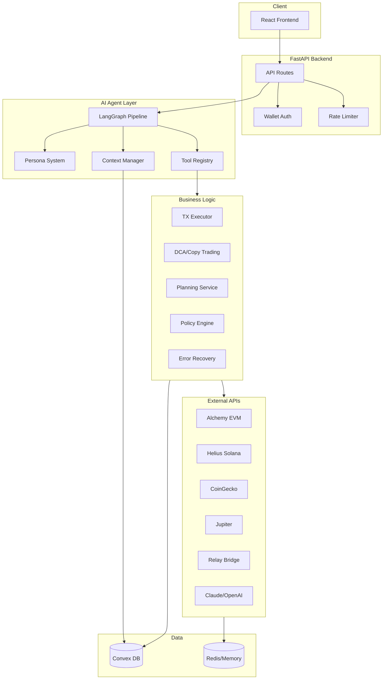
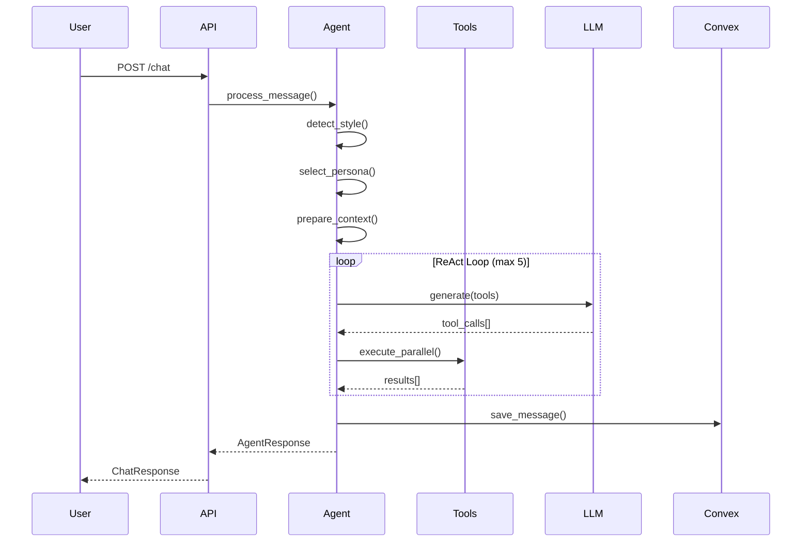
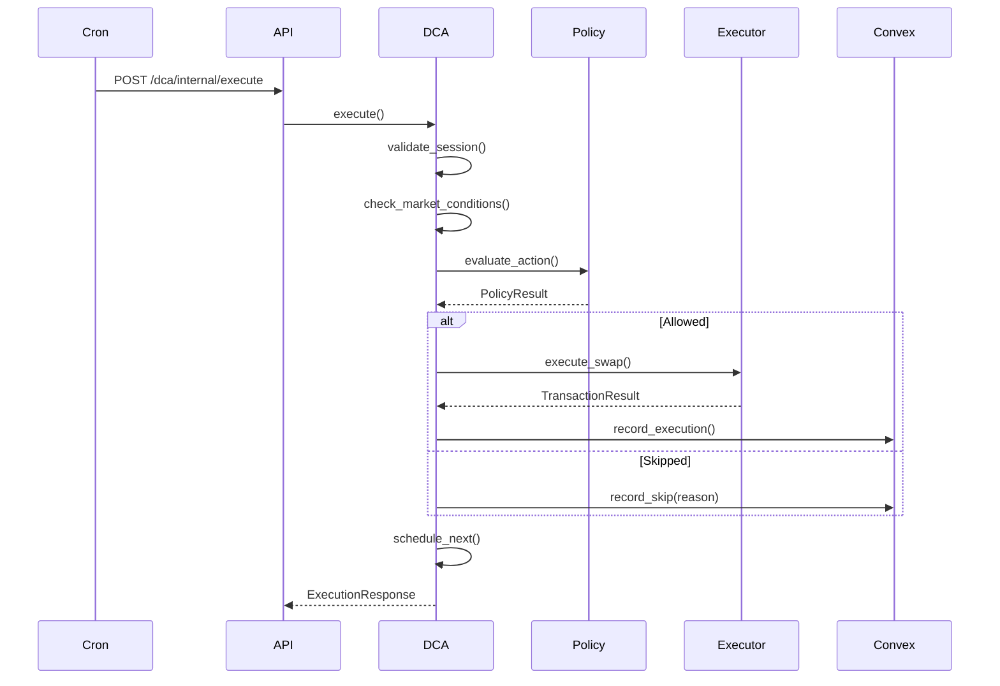

# Sherpa Backend Codebase Map

> Auto-generated by Cartographer. Last mapped: 2025-01-14

## System Overview

Sherpa is an AI-powered DeFi portfolio assistant with LLM-driven natural language conversations, automated trading strategies (DCA, Copy Trading), multi-chain support (EVM + Solana), and comprehensive portfolio insights.



## Directory Structure

```
backend/
├── app/                          # Main application
│   ├── main.py                   # FastAPI entry point
│   ├── config.py                 # Pydantic settings (env vars)
│   ├── cache.py                  # In-memory TTL cache
│   │
│   ├── api/                      # FastAPI route handlers
│   │   ├── auth.py               # Wallet authentication endpoints
│   │   ├── chat.py               # Chat endpoints (streaming/non-streaming)
│   │   ├── conversations.py      # Conversation history CRUD
│   │   ├── copy_trading.py       # Copy trading management
│   │   ├── dca.py                # DCA strategy lifecycle
│   │   ├── entitlement.py        # Token-gated access
│   │   ├── health.py             # Health checks
│   │   ├── history_summary.py    # Wallet activity analysis
│   │   ├── llm.py                # LLM provider info
│   │   ├── news.py               # News aggregation
│   │   ├── perps.py              # Perpetuals simulation
│   │   ├── relay.py              # Bridge quotes
│   │   ├── swap.py               # Swap quotes
│   │   ├── tools.py              # Portfolio/market data
│   │   └── webhooks.py           # Event monitoring
│   │
│   ├── agent_runtime/            # Always-on background runtime
│   │   ├── runtime.py            # Event loop & strategy scheduler
│   │   ├── strategy.py           # Base strategy class
│   │   ├── router.py             # Runtime control API
│   │   └── strategies/           # Built-in strategies
│   │       ├── heartbeat.py      # Liveness monitoring
│   │       └── execution_poller.py # Strategy approval polling
│   │
│   ├── auth/                     # Authentication system
│   │   ├── service.py            # Wallet sign-in + JWT management
│   │   ├── models.py             # Auth data models
│   │   ├── solana_signin.py      # Solana sign-in parsing + signature checks
│   │   └── middleware.py         # Auth dependencies
│   │
│   ├── core/                     # Business logic
│   │   ├── agent/                # LLM agent system
│   │   │   ├── base.py           # Agent orchestrator (1883 lines)
│   │   │   ├── graph.py          # LangGraph pipeline
│   │   │   ├── context.py        # Conversation memory
│   │   │   ├── personas.py       # YAML-driven personas
│   │   │   ├── styles.py         # Response style manager
│   │   │   └── tools.py          # Tool registry (20+ tools)
│   │   │
│   │   ├── execution/            # Transaction execution
│   │   │   ├── executor.py       # EVM TX executor
│   │   │   ├── solana_executor.py # Solana TX executor
│   │   │   ├── nonce_manager.py  # Concurrent nonce tracking
│   │   │   ├── tx_builder.py     # Transaction construction
│   │   │   └── models.py         # TX data models
│   │   │
│   │   ├── wallet/               # Session key system
│   │   │   ├── session_manager.py # Session lifecycle
│   │   │   └── models.py         # Permission/limit models
│   │   │
│   │   ├── swap/                 # Swap orchestration
│   │   │   ├── manager.py        # Relay-powered swaps
│   │   │   ├── models.py         # Swap state
│   │   │   └── constants.py      # Token registry
│   │   │
│   │   ├── bridge/               # Cross-chain bridging
│   │   │   ├── manager.py        # Bridge orchestration
│   │   │   ├── models.py         # Bridge state
│   │   │   └── constants.py      # Chain metadata
│   │   │
│   │   ├── strategy/             # Execution state machine
│   │   │   ├── state_machine.py  # State transitions
│   │   │   ├── handlers.py       # State handlers
│   │   │   ├── persistence.py    # Convex persistence
│   │   │   └── models.py         # State/execution models
│   │   │
│   │   ├── planning/             # Plan creation system
│   │   │   ├── service.py        # Plan orchestrator
│   │   │   ├── protocol.py       # Strategy abstractions
│   │   │   ├── models.py         # Plan/action models
│   │   │   ├── config.py         # ERC-7208 agent config
│   │   │   └── registry.py       # Activity registry (YAML)
│   │   │
│   │   ├── strategies/           # Trading strategies
│   │   │   └── dca/              # Dollar-cost averaging
│   │   │       ├── service.py    # DCA CRUD & lifecycle
│   │   │       ├── executor.py   # DCA execution logic
│   │   │       ├── scheduler.py  # Next execution calc
│   │   │       └── models.py     # DCA data models
│   │   │
│   │   ├── copy_trading/         # Copy trading system
│   │   │   ├── manager.py        # Relationship orchestration
│   │   │   ├── executor.py       # Cross-chain execution
│   │   │   ├── analytics.py      # Leader performance
│   │   │   ├── sizing.py         # Position sizing strategies
│   │   │   ├── event_bridge.py   # Event → signal bridge
│   │   │   └── models.py         # Copy trading models
│   │   │
│   │   ├── policy/               # 3-layer policy engine
│   │   │   ├── engine.py         # Policy orchestrator
│   │   │   ├── system_policy.py  # Platform safety
│   │   │   ├── session_policy.py # Session key limits
│   │   │   ├── risk_policy.py    # User risk prefs
│   │   │   └── models.py         # Policy models
│   │   │
│   │   ├── recovery/             # Error handling
│   │   │   ├── executor.py       # Resilient execution
│   │   │   ├── strategies.py     # Retry/backoff/circuit breaker
│   │   │   └── errors.py         # Error classification
│   │   │
│   │   ├── perps/                # Perpetuals trading
│   │   │   ├── policies.py       # Perps risk policies
│   │   │   ├── risk.py           # VaR, liquidation calcs
│   │   │   └── providers/        # GMX, Perennial, CEX
│   │   │
│   │   ├── chain_types.py        # ChainId type definitions
│   │   └── chat.py               # Chat facade
│   │
│   ├── providers/                # External API clients
│   │   ├── base.py               # Provider abstractions
│   │   ├── alchemy.py            # Alchemy EVM indexer
│   │   ├── solana.py             # Helius Solana indexer
│   │   ├── coingecko.py          # Token prices/metadata
│   │   ├── jupiter.py            # Solana tokens/swaps
│   │   ├── relay.py              # Cross-chain bridge
│   │   ├── token_list.py         # Fallback token data
│   │   └── llm/                  # LLM providers
│   │       ├── base.py           # LLM abstraction
│   │       ├── anthropic.py      # Claude integration
│   │       └── zai.py            # Z AI integration
│   │
│   ├── services/                 # Business services
│   │   ├── activity_summary.py   # Wallet activity reports
│   │   ├── portfolio_activity.py # Multi-chain activity
│   │   ├── history_comparison.py # Window comparison
│   │   ├── token_resolution.py   # Multi-source token lookup
│   │   ├── token_chart.py        # Price chart data
│   │   ├── trending.py           # Trending tokens
│   │   ├── entitlement.py        # Token-gated access
│   │   ├── address.py            # Chain/address utils
│   │   ├── cache.py              # Redis/memory cache
│   │   ├── evm.py                # EVM chain utils
│   │   ├── news_fetcher/         # News aggregation
│   │   ├── events/               # Webhook event processing
│   │   ├── relevance/            # Content relevance scoring
│   │   └── token_catalog/        # Token taxonomy
│   │
│   ├── tools/                    # Data aggregation tools
│   │   ├── portfolio.py          # Multi-chain portfolio
│   │   ├── aggregators.py        # Swap quote aggregation
│   │   ├── defillama.py          # Protocol TVL data
│   │   └── polymarket.py         # Prediction markets
│   │
│   ├── types/                    # Pydantic models
│   │   ├── envelope.py           # API response wrapper
│   │   ├── portfolio.py          # Portfolio models
│   │   ├── requests.py           # Request models
│   │   └── responses.py          # Response models
│   │
│   ├── db/                       # Database layer
│   │   └── convex_client.py      # Convex HTTP client
│   │
│   ├── middleware/               # HTTP middleware
│   │   └── rate_limit.py         # Distributed rate limiting
│   │
│   ├── workers/                  # Background tasks
│   │   ├── exports.py            # History export generation
│   │   └── news_processor_worker.py # LLM news classification
│   │
│   └── telemetry/                # Metrics
│       └── history.py            # History endpoint metrics
│
├── personas/                     # Agent persona configs
│   ├── friendly.yaml             # Warm, conversational
│   ├── educational.yaml          # Patient, teaching
│   ├── professional.yaml         # Formal, advisory
│   └── technical.yaml            # Analytical, precise
│
├── activities/                   # Activity definitions (YAML)
│   ├── swap.yaml
│   └── bridge.yaml
│
├── tests/                        # Test suite
├── docs/                         # Documentation
├── cli.py                        # CLI tools
├── main.py                       # Standalone entry
└── pyproject.toml                # Dependencies
```

## Module Guide

### API Layer (`app/api/`)

**Purpose**: FastAPI route handlers exposing all backend functionality

| File | Purpose | Key Routes |
|------|---------|-----------|
| `auth.py` | Wallet authentication | `/auth/nonce`, `/auth/verify`, `/auth/refresh` |
| `chat.py` | Conversational AI | `/chat`, `/chat/stream` |
| `conversations.py` | History management | `/conversations/*` |
| `copy_trading.py` | Copy trading CRUD | `/copy-trading/*` |
| `dca.py` | DCA strategy lifecycle | `/dca/*` |
| `swap.py` | Token swap quotes | `/swap/quote` |
| `tools.py` | Portfolio/market data | `/tools/portfolio`, `/tools/prices/*` |
| `webhooks.py` | Event monitoring | `/webhooks/alchemy`, `/webhooks/helius` |

**Dependencies**: Services, providers, core business logic
**Patterns**: Dependency injection, async/await, Pydantic validation

---

### Agent System (`app/core/agent/`)

**Purpose**: LLM-powered conversational agent with tool calling (ReAct loop)

| File | Lines | Purpose |
|------|-------|---------|
| `base.py` | 1883 | Main Agent orchestrator |
| `graph.py` | 195 | LangGraph pipeline (8 nodes) |
| `context.py` | 794 | Conversation memory + Convex sync |
| `tools.py` | 2047 | Tool registry (20+ tools) |
| `personas.py` | 252 | YAML-driven personality system |
| `styles.py` | 219 | Response formatting styles |

**Key Features**:
- LangGraph DAG: style → persona → context → ReAct loop → response
- LLM-native tool calling (not keyword-based)
- Parallel tool execution (max 5 iterations)
- Persona auto-detection from message content
- Convex persistence for conversation durability

**Patterns**: Pipeline, ReAct loop, Strategy (personas), Registry (tools)

---

### Execution Layer (`app/core/execution/`)

**Purpose**: Multi-chain transaction building, signing, and monitoring

| File | Purpose |
|------|---------|
| `executor.py` | EVM transaction lifecycle (gas, nonce, submit, confirm) |
| `solana_executor.py` | Solana transaction submission + confirmation |
| `nonce_manager.py` | Concurrent nonce reservation (prevents conflicts) |
| `tx_builder.py` | Transaction construction (ERC-20, native, quotes) |
| `models.py` | TransactionType, Status, GasEstimate, PreparedTransaction |

**EVM Flow**: Quote → Build → Reserve Nonce → Estimate Gas → Sign → Submit → Monitor → Confirm
**Solana Flow**: Jupiter Quote → Build → Sign → Submit → Poll Confirmation

**Patterns**: Singleton, async locks, exponential backoff

---

### Strategy System (`app/core/strategy/`)

**Purpose**: State machine for autonomous strategy execution

**States**: IDLE → ANALYZING → PLANNING → AWAITING_APPROVAL → EXECUTING → MONITORING → COMPLETED/FAILED

| File | Purpose |
|------|---------|
| `state_machine.py` | Validated state transitions with timeouts |
| `handlers.py` | State-specific logic (analyze, plan, execute, monitor) |
| `persistence.py` | Convex sync on every transition |
| `models.py` | StrategyState, ExecutionStep, ExecutionContext |

**Patterns**: State machine, callback hooks, audit trail

---

### DCA Strategies (`app/core/strategies/dca/`)

**Purpose**: Dollar-cost averaging with constraints and scheduling

| File | Purpose |
|------|---------|
| `service.py` | CRUD, lifecycle (create/activate/pause/stop) |
| `executor.py` | Execution with market condition checks |
| `scheduler.py` | Next execution calculation (hourly → monthly + cron) |
| `models.py` | DCAStrategy, DCAConfig, DCAExecution, SkipReason |

**Constraints**: Gas limits, price bounds, budget caps, execution counts, end dates

---

### Copy Trading (`app/core/copy_trading/`)

**Purpose**: Follow leader wallets and replicate trades

| File | Lines | Purpose |
|------|-------|---------|
| `manager.py` | 670+ | Relationship CRUD, signal processing |
| `executor.py` | - | Cross-chain swap execution |
| `analytics.py` | - | Leader performance (Sharpe, win rate, drawdown) |
| `sizing.py` | - | Position sizing strategies |
| `event_bridge.py` | - | Event → TradeSignal conversion |
| `models.py` | - | CopyConfig, CopyRelationship, LeaderProfile |

**Sizing Modes**: Percentage, Fixed, Proportional, Risk-Adjusted

---

### Policy Engine (`app/core/policy/`)

**Purpose**: Three-layer authorization and risk management

| Layer | File | Checks |
|-------|------|--------|
| System | `system_policy.py` | Emergency stop, maintenance, blocked contracts |
| Session | `session_policy.py` | Permissions, value limits, allowlists |
| Risk | `risk_policy.py` | Position size, concentration, daily limits |

**Evaluation Order**: System → Session → Risk
**Output**: PolicyResult with allowed/denied, violations, risk score

---

### Providers (`app/providers/`)

**Purpose**: External API abstractions

| Provider | File | Purpose |
|----------|------|---------|
| Alchemy | `alchemy.py` | EVM balances, tokens, NFTs |
| Solana | `solana.py` | SOL/SPL balances via Helius |
| CoinGecko | `coingecko.py` | Prices, metadata, charts, trending |
| Jupiter | `jupiter.py` | Solana token list, prices, swap quotes |
| Relay | `relay.py` | Cross-chain bridge quotes |
| Anthropic | `llm/anthropic.py` | Claude with tool calling |
| Z AI | `llm/zai.py` | Chat completions |

**Patterns**: Provider abstraction, health checks, fallbacks

---

### Services (`app/services/`)

**Purpose**: Business logic orchestrating providers

| Service | File | Purpose |
|---------|------|---------|
| Token Resolution | `token_resolution.py` | Multi-source lookup with confidence scoring |
| Activity Summary | `activity_summary.py` | Time-bucketed wallet reports |
| Entitlement | `entitlement.py` | Token-gated Pro access |
| News Fetcher | `news_fetcher/` | Multi-source aggregation + LLM classification |
| Events | `events/` | Webhook processing + subscriptions |
| Token Catalog | `token_catalog/` | Taxonomy and portfolio profiling |

---

## Data Flow

### Chat Request Flow



### DCA Execution Flow



## Authentication Flow

```
1. POST /auth/nonce → Generate nonce (10 min TTL)
2. Client signs wallet sign-in message with wallet (EVM SIWE or Solana sign-in)
3. POST /auth/verify → Verify signature, create JWT session
4. Bearer token in subsequent requests
5. POST /auth/refresh → Rotate tokens (7 day refresh)
6. POST /auth/logout → Revoke session
```

**Token Lifetimes**: Nonce (10 min), Access (1 hour), Refresh (7 days)

## Conventions

### Code Style
- **Type hints**: Required everywhere
- **Async/await**: All I/O operations
- **Pydantic v2**: All data models
- **Decimal**: Financial calculations
- **Singleton pattern**: Providers, managers, caches

### Naming
- `*Provider`: External API clients
- `*Service`: Business logic orchestrators
- `*Manager`: Stateful orchestrators
- `*Executor`: Transaction/action executors
- `*Handler`: Event/webhook processors

### Error Handling
- Custom exception hierarchies per domain
- Fail-open for non-critical paths (rate limiting)
- Exponential backoff for transient errors
- Circuit breakers for cascading failures

## Gotchas

1. **Nonce conflicts**: Use NonceManager for concurrent transactions
2. **Convex mutations**: HTTP-based, not WebSocket - no real-time subscriptions
3. **Jupiter token list**: 1500 strict tokens in memory, 20k+ for unverified fallback
4. **Session keys**: Time-limited, permission-scoped - check expiry before execution
5. **Rate limiting**: Convex-backed, fail-open on errors
6. **Persona detection**: Auto-detect can override explicit selection
7. **Tool calling**: LLM-native (not keyword parsing) - tools must be registered

## Navigation Guide

**To add a new API endpoint**:
1. Create handler in `app/api/`
2. Register router in `app/main.py`
3. Add Pydantic models to `app/types/`

**To add a new agent tool**:
1. Add handler in `app/core/agent/tools.py`
2. Register in `ToolRegistry` with definition

**To add a new persona**:
1. Create YAML in `personas/`
2. Add keywords for auto-detection

**To add a new provider**:
1. Implement `Provider` base in `app/providers/`
2. Add health check
3. Register singleton factory

**To add a new strategy type**:
1. Create module in `app/core/strategies/`
2. Implement executor, scheduler, models
3. Add API endpoints in `app/api/`
4. Register in planning registry

**To modify policy rules**:
1. Edit relevant policy in `app/core/policy/`
2. Add new ViolationSeverity if needed
3. Update PolicyEngine evaluation order if new layer
